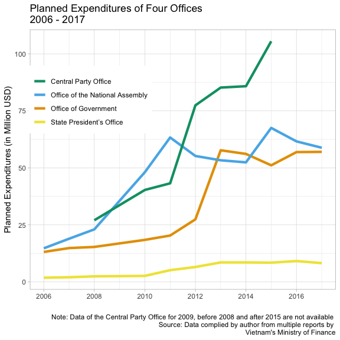
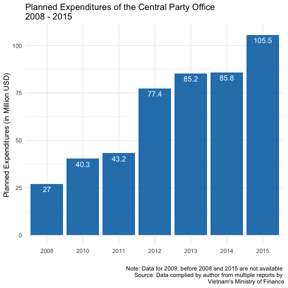

## A View of the Vietnamese Communist Party’s Internal Tension through the Budget of the Central Party Office

**Authors:** [Thuy Nguyen](https://www.linkedin.com/in/nguyendata/),
Tuong Vu

[Read my full article
here](https://usvietnam.uoregon.edu/en/a-view-of-the-vietnamese-communist-partys-internal-tension-through-the-budget-of-the-central-party-office/)

``` r
library(dplyr)
library(ggplot2)
library(tidyverse)
library(plotly)
library(colorblindr)
library(lubridate)

data <- rio::import(here::here("data", "du toan chi co quan TW_complile_2006_2020.xlsx"), skip = 4) 

pd <- data %>% 
  pivot_longer(cols = c("2006":"2020"),
                names_to = "Year",
               values_to = "Amount") %>% 
  filter(`Central Agencies` != "Central finance management board") %>% 
  mutate(Amount_milusd = round(Amount/23000, 1)) #1 usd = 23000 vnd
```

### The Offices of the “Four Pillars”

The Vietnamese Communist Party (VCP) is not only the ruling party in
Vietnam but is also the only political party that exists legally in this
country of nearly 100 million people. As in other communist countries,
the VCP’s domination is written into the country’s constitution. There
is no law that bans the formation of political parties but the
authorities would arrest and imprison anyone who attempts to challenge
the VCP’s monopoly.

``` r
four_office <- pd %>% 
  filter(`Central Agencies` == "Presidential secretariat" |
           `Central Agencies` == "National assembly's secretariat"|
             `Central Agencies` == "Governmental office" |
           `Central Agencies` == "Office of central party committee") %>% 
  drop_na() %>% 
  mutate(Year = make_date(Year)) 


four_office %>% 
  ggplot(aes(Year, Amount_milusd, group = `Central Agencies`, fill = `Central Agencies`)) +
  geom_line(aes(color = `Central Agencies`), size = 1.5) +
   scale_color_OkabeIto(name = "Office of",
                       breaks = c("Office of central party committee", "National assembly's secretariat", # keep the breaks as the variables in the data set
                                   "Governmental office", "Presidential secretariat"),
                      labels = c("Central Party Office", "Office of the National Assembly", # how we want to call it in the plot
                                   "Office of Government", "State President’s Office")) + 
  labs(title = "Planned Expenditures of Four Offices \n2006 - 2017",
         x = "",
         y = "Planned Expenditures (in Million USD)",
         caption = "Note: Data of the Central Party Office for 2009, before 2008 and after 2015 are not available \nSource: Data complied by author from multiple reports by \nVietnam's Ministry of Finance") +
  #scale_x_discrete(breaks = 2006:2017) +
  theme(
  legend.position = c(.4, .6),
  legend.justification = c("right", "bottom"),
  legend.box.just = "right",
  legend.margin = margin(6, 6, 6, 6),
  legend.title = element_blank()
  ) 
```



The Central Party Office (CPO) coordinates Party business under the
direct supervision of the Politburo and the Secretariat. The General
Secretary of the VCP is considered one of the four “pillars” of the
regime in Vietnam. The other three “pillars” include the State
President, the Prime Minister, and the Chair of the National Assembly.
The Secretary is primus inter pares among the four.

Like the Central Party Office (CPO), three other offices play the same
role for three remaining government “pillars,” including 1) the State
President’s Office (SPO) to coordinate the business of the State
President and the Vice President; 2) the Office of Government (OG), a
ministerial-level agency under the Prime Minister; and 3) the Office of
the National Assembly (ONA) to serve Chair of the National Assembly,
Vice-Chairs, the Standing Committee and other Committees, and the Ethnic
Council of the National Assembly.

Since the Prime Minister oversees the most activities of the government,
one would expect the Office of Government to have the largest budget
among the four. But this is not the case. As Vietnam’s national income
has increased at the rate of 5-7% in the last decade, one also expects
the budgets of all four agencies to increase; yet our data shows a
pattern of uneven increase under the leadership of the VCP’s General
Secretary Nguyen Phu Trong since 2011.

### Where Have All the Money Gone?

The planned expenditures of the Central Party Office show an increase of
4 times in 7 years between 2008 and 2015, from nearly USD 27 million
(VND 622 billion) to about USD 105 million USD (more than VND2400
billion).

``` r
pd_party <- pd %>% 
  filter(`Central Agencies` == "Office of central party committee") %>% 
  drop_na() %>% 
ggplot(aes(Year, Amount_milusd)) +
    geom_col(fill = "#0072B2", alpha = .9) +
  geom_text(aes(label= Amount_milusd), color = "white", vjust = 1.5) +
    labs(title = "Planned Expenditures of the Central Party Office \n2008 - 2015",
         x = "",
         y = "Planned Expenditures (in Million USD)",
         caption = "Note: Data for 2009, before 2008 and 2015 are not available \nSource: Data complied by author from multiple reports by \nVietnam's Ministry of Finance") +
  scale_x_discrete(breaks = 2008:2015) +
  theme_minimal()
pd_party
```



### Planned Expenditures of Some Central Offices 2006-2017

``` r
library(gt)
allyr <- pd %>% 
  filter(`Central Agencies` != "Supreme people's court" & 
          `Central Agencies` != "Supreme people's court of investigation" &
         `Central Agencies` != "Office of Central Committee for directing prevention and  anti-corruption" &
           Year != 2020 &
           Year != 2019 &
           Year != 2018) %>% 
  select("Central Agencies", "Amount_milusd", "Year") %>% 
  pivot_wider(values_from = Amount_milusd,
              names_from = Year) 

allyr[1, 1] <- "State President’s Office"
allyr[2, 1] <- "Office of the National Assembly"
allyr[4, 1] <- "Office of Government"
allyr[5, 1] <- "Central Party Office"
  
tb_allyr <- allyr %>% 
  gt() %>% 
  cols_label(`Central Agencies` = "") %>% 
  cols_align(align = "left") %>% 
  tab_header(title = "Planned Expenditures of Some Central Offices \n2006-2017",
           subtitle = "(in million USD)") %>% 
  tab_source_note("Data complied by author from multiple reports by \nVietnam's Ministry of Finance")
tb_allyr
```

<style>html {
  font-family: -apple-system, BlinkMacSystemFont, 'Segoe UI', Roboto, Oxygen, Ubuntu, Cantarell, 'Helvetica Neue', 'Fira Sans', 'Droid Sans', Arial, sans-serif;
}

#cqbkrivomy .gt_table {
  display: table;
  border-collapse: collapse;
  margin-left: auto;
  margin-right: auto;
  color: #333333;
  font-size: 16px;
  background-color: #FFFFFF;
  width: auto;
  border-top-style: solid;
  border-top-width: 2px;
  border-top-color: #A8A8A8;
  border-right-style: none;
  border-right-width: 2px;
  border-right-color: #D3D3D3;
  border-bottom-style: solid;
  border-bottom-width: 2px;
  border-bottom-color: #A8A8A8;
  border-left-style: none;
  border-left-width: 2px;
  border-left-color: #D3D3D3;
}

#cqbkrivomy .gt_heading {
  background-color: #FFFFFF;
  text-align: center;
  border-bottom-color: #FFFFFF;
  border-left-style: none;
  border-left-width: 1px;
  border-left-color: #D3D3D3;
  border-right-style: none;
  border-right-width: 1px;
  border-right-color: #D3D3D3;
}

#cqbkrivomy .gt_title {
  color: #333333;
  font-size: 125%;
  font-weight: initial;
  padding-top: 4px;
  padding-bottom: 4px;
  border-bottom-color: #FFFFFF;
  border-bottom-width: 0;
}

#cqbkrivomy .gt_subtitle {
  color: #333333;
  font-size: 85%;
  font-weight: initial;
  padding-top: 0;
  padding-bottom: 4px;
  border-top-color: #FFFFFF;
  border-top-width: 0;
}

#cqbkrivomy .gt_bottom_border {
  border-bottom-style: solid;
  border-bottom-width: 2px;
  border-bottom-color: #D3D3D3;
}

#cqbkrivomy .gt_col_headings {
  border-top-style: solid;
  border-top-width: 2px;
  border-top-color: #D3D3D3;
  border-bottom-style: solid;
  border-bottom-width: 2px;
  border-bottom-color: #D3D3D3;
  border-left-style: none;
  border-left-width: 1px;
  border-left-color: #D3D3D3;
  border-right-style: none;
  border-right-width: 1px;
  border-right-color: #D3D3D3;
}

#cqbkrivomy .gt_col_heading {
  color: #333333;
  background-color: #FFFFFF;
  font-size: 100%;
  font-weight: normal;
  text-transform: inherit;
  border-left-style: none;
  border-left-width: 1px;
  border-left-color: #D3D3D3;
  border-right-style: none;
  border-right-width: 1px;
  border-right-color: #D3D3D3;
  vertical-align: bottom;
  padding-top: 5px;
  padding-bottom: 6px;
  padding-left: 5px;
  padding-right: 5px;
  overflow-x: hidden;
}

#cqbkrivomy .gt_column_spanner_outer {
  color: #333333;
  background-color: #FFFFFF;
  font-size: 100%;
  font-weight: normal;
  text-transform: inherit;
  padding-top: 0;
  padding-bottom: 0;
  padding-left: 4px;
  padding-right: 4px;
}

#cqbkrivomy .gt_column_spanner_outer:first-child {
  padding-left: 0;
}

#cqbkrivomy .gt_column_spanner_outer:last-child {
  padding-right: 0;
}

#cqbkrivomy .gt_column_spanner {
  border-bottom-style: solid;
  border-bottom-width: 2px;
  border-bottom-color: #D3D3D3;
  vertical-align: bottom;
  padding-top: 5px;
  padding-bottom: 6px;
  overflow-x: hidden;
  display: inline-block;
  width: 100%;
}

#cqbkrivomy .gt_group_heading {
  padding: 8px;
  color: #333333;
  background-color: #FFFFFF;
  font-size: 100%;
  font-weight: initial;
  text-transform: inherit;
  border-top-style: solid;
  border-top-width: 2px;
  border-top-color: #D3D3D3;
  border-bottom-style: solid;
  border-bottom-width: 2px;
  border-bottom-color: #D3D3D3;
  border-left-style: none;
  border-left-width: 1px;
  border-left-color: #D3D3D3;
  border-right-style: none;
  border-right-width: 1px;
  border-right-color: #D3D3D3;
  vertical-align: middle;
}

#cqbkrivomy .gt_empty_group_heading {
  padding: 0.5px;
  color: #333333;
  background-color: #FFFFFF;
  font-size: 100%;
  font-weight: initial;
  border-top-style: solid;
  border-top-width: 2px;
  border-top-color: #D3D3D3;
  border-bottom-style: solid;
  border-bottom-width: 2px;
  border-bottom-color: #D3D3D3;
  vertical-align: middle;
}

#cqbkrivomy .gt_striped {
  background-color: rgba(128, 128, 128, 0.05);
}

#cqbkrivomy .gt_from_md > :first-child {
  margin-top: 0;
}

#cqbkrivomy .gt_from_md > :last-child {
  margin-bottom: 0;
}

#cqbkrivomy .gt_row {
  padding-top: 8px;
  padding-bottom: 8px;
  padding-left: 5px;
  padding-right: 5px;
  margin: 10px;
  border-top-style: solid;
  border-top-width: 1px;
  border-top-color: #D3D3D3;
  border-left-style: none;
  border-left-width: 1px;
  border-left-color: #D3D3D3;
  border-right-style: none;
  border-right-width: 1px;
  border-right-color: #D3D3D3;
  vertical-align: middle;
  overflow-x: hidden;
}

#cqbkrivomy .gt_stub {
  color: #333333;
  background-color: #FFFFFF;
  font-size: 100%;
  font-weight: initial;
  text-transform: inherit;
  border-right-style: solid;
  border-right-width: 2px;
  border-right-color: #D3D3D3;
  padding-left: 12px;
}

#cqbkrivomy .gt_summary_row {
  color: #333333;
  background-color: #FFFFFF;
  text-transform: inherit;
  padding-top: 8px;
  padding-bottom: 8px;
  padding-left: 5px;
  padding-right: 5px;
}

#cqbkrivomy .gt_first_summary_row {
  padding-top: 8px;
  padding-bottom: 8px;
  padding-left: 5px;
  padding-right: 5px;
  border-top-style: solid;
  border-top-width: 2px;
  border-top-color: #D3D3D3;
}

#cqbkrivomy .gt_grand_summary_row {
  color: #333333;
  background-color: #FFFFFF;
  text-transform: inherit;
  padding-top: 8px;
  padding-bottom: 8px;
  padding-left: 5px;
  padding-right: 5px;
}

#cqbkrivomy .gt_first_grand_summary_row {
  padding-top: 8px;
  padding-bottom: 8px;
  padding-left: 5px;
  padding-right: 5px;
  border-top-style: double;
  border-top-width: 6px;
  border-top-color: #D3D3D3;
}

#cqbkrivomy .gt_table_body {
  border-top-style: solid;
  border-top-width: 2px;
  border-top-color: #D3D3D3;
  border-bottom-style: solid;
  border-bottom-width: 2px;
  border-bottom-color: #D3D3D3;
}

#cqbkrivomy .gt_footnotes {
  color: #333333;
  background-color: #FFFFFF;
  border-bottom-style: none;
  border-bottom-width: 2px;
  border-bottom-color: #D3D3D3;
  border-left-style: none;
  border-left-width: 2px;
  border-left-color: #D3D3D3;
  border-right-style: none;
  border-right-width: 2px;
  border-right-color: #D3D3D3;
}

#cqbkrivomy .gt_footnote {
  margin: 0px;
  font-size: 90%;
  padding: 4px;
}

#cqbkrivomy .gt_sourcenotes {
  color: #333333;
  background-color: #FFFFFF;
  border-bottom-style: none;
  border-bottom-width: 2px;
  border-bottom-color: #D3D3D3;
  border-left-style: none;
  border-left-width: 2px;
  border-left-color: #D3D3D3;
  border-right-style: none;
  border-right-width: 2px;
  border-right-color: #D3D3D3;
}

#cqbkrivomy .gt_sourcenote {
  font-size: 90%;
  padding: 4px;
}

#cqbkrivomy .gt_left {
  text-align: left;
}

#cqbkrivomy .gt_center {
  text-align: center;
}

#cqbkrivomy .gt_right {
  text-align: right;
  font-variant-numeric: tabular-nums;
}

#cqbkrivomy .gt_font_normal {
  font-weight: normal;
}

#cqbkrivomy .gt_font_bold {
  font-weight: bold;
}

#cqbkrivomy .gt_font_italic {
  font-style: italic;
}

#cqbkrivomy .gt_super {
  font-size: 65%;
}

#cqbkrivomy .gt_footnote_marks {
  font-style: italic;
  font-size: 65%;
}
</style>
<div id="cqbkrivomy" style="overflow-x:auto;overflow-y:auto;width:auto;height:auto;"><table class="gt_table">
  <thead class="gt_header">
    <tr>
      <th colspan="12" class="gt_heading gt_title gt_font_normal" style>Planned Expenditures of Some Central Offices 
2006-2017</th>
    </tr>
    <tr>
      <th colspan="12" class="gt_heading gt_subtitle gt_font_normal gt_bottom_border" style>(in million USD)</th>
    </tr>
  </thead>
  <thead class="gt_col_headings">
    <tr>
      <th class="gt_col_heading gt_columns_bottom_border gt_left" rowspan="1" colspan="1"></th>
      <th class="gt_col_heading gt_columns_bottom_border gt_left" rowspan="1" colspan="1">2006</th>
      <th class="gt_col_heading gt_columns_bottom_border gt_left" rowspan="1" colspan="1">2007</th>
      <th class="gt_col_heading gt_columns_bottom_border gt_left" rowspan="1" colspan="1">2008</th>
      <th class="gt_col_heading gt_columns_bottom_border gt_left" rowspan="1" colspan="1">2010</th>
      <th class="gt_col_heading gt_columns_bottom_border gt_left" rowspan="1" colspan="1">2011</th>
      <th class="gt_col_heading gt_columns_bottom_border gt_left" rowspan="1" colspan="1">2012</th>
      <th class="gt_col_heading gt_columns_bottom_border gt_left" rowspan="1" colspan="1">2013</th>
      <th class="gt_col_heading gt_columns_bottom_border gt_left" rowspan="1" colspan="1">2014</th>
      <th class="gt_col_heading gt_columns_bottom_border gt_left" rowspan="1" colspan="1">2015</th>
      <th class="gt_col_heading gt_columns_bottom_border gt_left" rowspan="1" colspan="1">2016</th>
      <th class="gt_col_heading gt_columns_bottom_border gt_left" rowspan="1" colspan="1">2017</th>
    </tr>
  </thead>
  <tbody class="gt_table_body">
    <tr>
      <td class="gt_row gt_left">State President’s Office</td>
      <td class="gt_row gt_left">1.8</td>
      <td class="gt_row gt_left">2.0</td>
      <td class="gt_row gt_left">2.4</td>
      <td class="gt_row gt_left">2.6</td>
      <td class="gt_row gt_left">5.1</td>
      <td class="gt_row gt_left">6.5</td>
      <td class="gt_row gt_left">8.5</td>
      <td class="gt_row gt_left">8.5</td>
      <td class="gt_row gt_left">8.4</td>
      <td class="gt_row gt_left">9.1</td>
      <td class="gt_row gt_left">8.2</td>
    </tr>
    <tr>
      <td class="gt_row gt_left">Office of the National Assembly</td>
      <td class="gt_row gt_left">14.7</td>
      <td class="gt_row gt_left">18.9</td>
      <td class="gt_row gt_left">23.0</td>
      <td class="gt_row gt_left">48.1</td>
      <td class="gt_row gt_left">63.3</td>
      <td class="gt_row gt_left">55.2</td>
      <td class="gt_row gt_left">53.3</td>
      <td class="gt_row gt_left">52.4</td>
      <td class="gt_row gt_left">67.5</td>
      <td class="gt_row gt_left">61.6</td>
      <td class="gt_row gt_left">58.8</td>
    </tr>
    <tr>
      <td class="gt_row gt_left">HoChiMinh Academy of Politics</td>
      <td class="gt_row gt_left">7.3</td>
      <td class="gt_row gt_left">11.8</td>
      <td class="gt_row gt_left">15.6</td>
      <td class="gt_row gt_left">21.6</td>
      <td class="gt_row gt_left">23.6</td>
      <td class="gt_row gt_left">26.8</td>
      <td class="gt_row gt_left">30.3</td>
      <td class="gt_row gt_left">30.9</td>
      <td class="gt_row gt_left">27.8</td>
      <td class="gt_row gt_left">26.6</td>
      <td class="gt_row gt_left">30.1</td>
    </tr>
    <tr>
      <td class="gt_row gt_left">Office of Government</td>
      <td class="gt_row gt_left">13.1</td>
      <td class="gt_row gt_left">14.8</td>
      <td class="gt_row gt_left">15.3</td>
      <td class="gt_row gt_left">18.4</td>
      <td class="gt_row gt_left">20.3</td>
      <td class="gt_row gt_left">27.4</td>
      <td class="gt_row gt_left">57.7</td>
      <td class="gt_row gt_left">56.1</td>
      <td class="gt_row gt_left">51.1</td>
      <td class="gt_row gt_left">56.9</td>
      <td class="gt_row gt_left">57.0</td>
    </tr>
    <tr>
      <td class="gt_row gt_left">Central Party Office</td>
      <td class="gt_row gt_left">NA</td>
      <td class="gt_row gt_left">NA</td>
      <td class="gt_row gt_left">27.0</td>
      <td class="gt_row gt_left">40.3</td>
      <td class="gt_row gt_left">43.2</td>
      <td class="gt_row gt_left">77.4</td>
      <td class="gt_row gt_left">85.2</td>
      <td class="gt_row gt_left">85.8</td>
      <td class="gt_row gt_left">105.5</td>
      <td class="gt_row gt_left">NA</td>
      <td class="gt_row gt_left">NA</td>
    </tr>
    <tr>
      <td class="gt_row gt_left">Office of Central Committee for directing prevention and anti-corruption</td>
      <td class="gt_row gt_left">NA</td>
      <td class="gt_row gt_left">NA</td>
      <td class="gt_row gt_left">1.3</td>
      <td class="gt_row gt_left">1.3</td>
      <td class="gt_row gt_left">1.3</td>
      <td class="gt_row gt_left">1.3</td>
      <td class="gt_row gt_left">1.5</td>
      <td class="gt_row gt_left">NA</td>
      <td class="gt_row gt_left">NA</td>
      <td class="gt_row gt_left">NA</td>
      <td class="gt_row gt_left">NA</td>
    </tr>
  </tbody>
  <tfoot class="gt_sourcenotes">
    <tr>
      <td class="gt_sourcenote" colspan="12">Data complied by author from multiple reports by 
Vietnam's Ministry of Finance</td>
    </tr>
  </tfoot>
  
</table></div>
